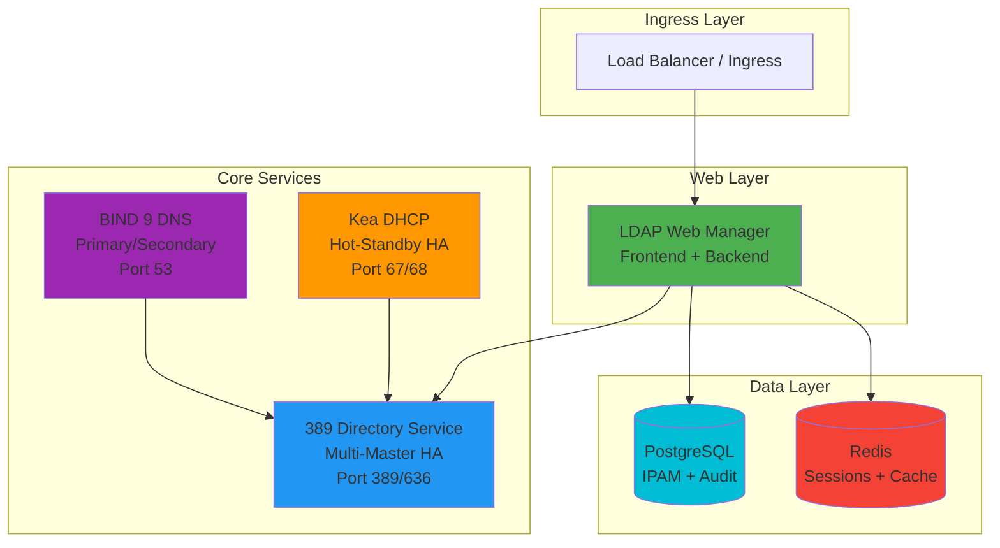

# LDAP Infrastructure Suite

**Version**: 1.0.0 (Development)  
**Status**: 🚧 In Planning  
**License**: MIT  

[](https://github.com/infrastructure-alexson/ldap-infrastructure-suite)
[](https://hub.docker.com/u/infrastructure-alexson)
[](https://kubernetes.io)
[](https://www.redhat.com/en/technologies/cloud-computing/openshift)

---

## Overview

**LDAP Infrastructure Suite** is a turnkey, containerized infrastructure solution that deploys and manages a complete LDAP-based infrastructure stack as a single, unified application. Deploy DNS, DHCP, LDAP, and web-based management with a single command.

### What's Included

- **🌐 LDAP Web Manager** - Modern web UI for infrastructure management
- **📂 389 Directory Service** - Enterprise LDAP with multi-master replication
- **🔌 Kea DHCP** - High-performance DHCP with LDAP backend
- **🌍 BIND 9 DNS** - DNS server with LDAP DLZ integration
- **🗄️ PostgreSQL** - Database for IPAM and audit logging
- **⚡ Redis** - Session management and caching

### Key Features

✅ **One-Command Deployment** - Deploy entire infrastructure with Docker Compose or Helm  
✅ **Unified Management** - Single web interface for all services  
✅ **High Availability** - Built-in HA for all critical components  
✅ **Cloud Native** - Kubernetes and OpenShift ready  
✅ **Service Discovery** - Automatic configuration between components  
✅ **GitOps Ready** - Infrastructure as code with version control  
✅ **Production Ready** - Security hardened and performance optimized  

---

## Architecture



---

## Quick Start

### Docker Compose (Recommended for Testing)

```bash
# Clone the repository
git clone https://github.com/infrastructure-alexson/ldap-infrastructure-suite.git
cd ldap-infrastructure-suite

# Copy and configure environment
cp .env.example .env
# Edit .env with your settings

# Deploy the full stack
docker-compose up -d

# Access web interface
open https://localhost
```

### Kubernetes with Helm (Production)

```bash
# Add Helm repository
helm repo add ldap-suite https://charts.infrastructure-alexson.org
helm repo update

# Install the suite
helm install infrastructure ldap-suite/ldap-infrastructure-suite \
  --namespace infrastructure \
  --create-namespace \
  --values my-values.yaml

# Check status
kubectl get pods -n infrastructure
```

### OpenShift Template

```bash
# Create project
oc new-project infrastructure

# Deploy from template
oc process -f openshift/suite-template.yaml \
  -p LDAP_ADMIN_PASSWORD=$(openssl rand -base64 32) \
  -p DOMAIN=svc.eh168.alexson.org \
  | oc create -f -

# Get route
oc get route ldap-manager -n infrastructure
```

---

## Components

### 1. LDAP Web Manager

Modern web-based management interface for all infrastructure services.

- **Frontend**: React SPA with Tailwind CSS
- **Backend**: FastAPI (Python) with async support
- **Features**:
  - User and group management (SSSD compatible)
  - DNS zone and record management
  - DHCP subnet and reservation management
  - IPAM with visual allocation maps
  - Audit logging and reporting
  - Role-based access control

**Ports**: 80 (HTTP), 443 (HTTPS), 8000 (API)

### 2. 389 Directory Service

Enterprise-grade LDAP server with comprehensive schema support.

- **Replication**: Multi-master for high availability
- **Schemas**: DHCP, DNS, POSIX users/groups, custom schemas
- **Features**:
  - Password policies and account lockout
  - Access control lists (ACLs)
  - TLS/SSL encryption
  - Replication monitoring
  - Backup and restore

**Ports**: 389 (LDAP), 636 (LDAPS)  
**Replicas**: 2+ for HA

### 3. Kea DHCP

Modern, high-performance DHCP server with LDAP backend.

- **HA Mode**: Hot-standby configuration
- **Backend**: LDAP for configuration storage
- **Features**:
  - IPv4 and IPv6 support
  - Static host reservations
  - Option definitions
  - Lease statistics via API
  - HA failover (sub-second)

**Ports**: 67/UDP (DHCP), 68/UDP (DHCP Client), 8000 (Control Agent API)  
**Replicas**: 2 (Primary + Standby)

### 4. BIND 9 DNS

Industry-standard DNS server with LDAP zone storage.

- **DLZ**: Dynamically Loadable Zones from LDAP
- **HA Mode**: Primary/secondary with zone transfers
- **Features**:
  - Forward and reverse zones
  - DNSSEC support (optional)
  - Dynamic updates
  - Zone transfers (AXFR/IXFR)
  - Query logging

**Ports**: 53/TCP and 53/UDP (DNS), 953 (rndc control)  
**Replicas**: 2+ (Primary + Secondaries)

### 5. PostgreSQL

Relational database for IPAM data and audit logs.

- **Version**: 16
- **Storage**: IPAM allocations, audit trail, session data
- **Features**:
  - Streaming replication (optional)
  - Point-in-time recovery
  - Connection pooling
  - Full-text search
  - JSON storage for flexible metadata

**Port**: 5432  
**Storage**: PersistentVolume

### 6. Redis

In-memory data store for sessions and caching.

- **Version**: 7
- **Mode**: Standalone or Sentinel (HA)
- **Features**:
  - Session storage
  - LDAP query caching
  - Statistics caching
  - TTL-based expiration
  - Persistence (AOF)

**Port**: 6379  
**Storage**: PersistentVolume (optional)

---

## Deployment Scenarios

### Scenario 1: Development/Lab Environment

**Docker Compose** with single replicas, minimal resources.

```bash
docker-compose -f docker-compose.yml up -d
```

- Rapid deployment (< 5 minutes)
- Low resource requirements
- Easy testing and development
- No persistent storage by default

### Scenario 2: Production On-Premises

**Kubernetes** with Helm chart, full HA configuration.

```bash
helm install infrastructure ldap-suite/ldap-infrastructure-suite \
  --set replicaCount.ldap=3 \
  --set replicaCount.dns=3 \
  --set replicaCount.dhcp=2 \
  --set postgresql.replication.enabled=true \
  --set redis.sentinel.enabled=true
```

- High availability
- Automatic failover
- Persistent storage
- Monitoring and alerting
- Backup automation

### Scenario 3: Cloud/OpenShift

**OpenShift Template** with cloud-native features.

```bash
oc process -f openshift/suite-template.yaml | oc create -f -
```

- Native cloud integration
- Auto-scaling
- Service mesh integration
- Cloud storage (EBS, Azure Disk, etc.)
- Cloud DNS integration

---

## Configuration

### Environment Variables

**Required Variables** (`.env` file):

```bash
# LDAP Configuration
LDAP_ADMIN_PASSWORD=your_secure_password
LDAP_DOMAIN=eh168.alexson.org
LDAP_BASE_DN=dc=eh168,dc=alexson,dc=org

# Database Configuration
DB_PASSWORD=your_database_password

# Application Security
JWT_SECRET=your_jwt_secret_key
SECRET_KEY=your_application_secret

# Network Configuration
DOMAIN=svc.eh168.alexson.org
ENABLE_TLS=true
```

**Optional Variables**:

```bash
# High Availability
LDAP_REPLICAS=2
DHCP_REPLICAS=2
DNS_REPLICAS=2

# Resource Limits
LDAP_MEMORY_LIMIT=2Gi
DHCP_MEMORY_LIMIT=512Mi
DNS_MEMORY_LIMIT=512Mi

# Feature Flags
ENABLE_DNSSEC=false
ENABLE_MONITORING=true
ENABLE_BACKUPS=true
```

---

## Management

### Web Interface

Access the LDAP Web Manager at:
- **Docker Compose**: https://localhost
- **Kubernetes**: https://ldap-manager.svc.eh168.alexson.org
- **OpenShift**: https://ldap-manager-infrastructure.apps.ocp.example.com

**Default Credentials**:
- Username: `admin`
- Password: Set during deployment or in `.env` file

### Command Line Tools

**Docker Compose**:
```bash
# View logs
docker-compose logs -f

# Restart services
docker-compose restart

# Scale services
docker-compose up -d --scale web-backend=3

# Stop all services
docker-compose down
```

**Kubernetes**:
```bash
# View pods
kubectl get pods -n infrastructure

# View logs
kubectl logs -f deployment/ldap-web-manager-backend -n infrastructure

# Scale deployment
kubectl scale deployment web-backend --replicas=5 -n infrastructure

# Delete deployment
helm uninstall infrastructure -n infrastructure
```

---

## Monitoring

### Built-in Metrics

The suite exposes metrics for monitoring:

- **Prometheus Endpoint**: `/metrics` on each service
- **Health Checks**: `/health` for readiness/liveness probes
- **LDAP Monitoring**: Connection pool, query performance
- **DHCP Stats**: Lease utilization, pool statistics
- **DNS Stats**: Query rates, zone transfers

### Grafana Dashboards

Pre-built Grafana dashboards included:

1. **Infrastructure Overview** - All services at a glance
2. **LDAP Performance** - Query latency, connection pools
3. **DNS Analytics** - Query types, top domains
4. **DHCP Statistics** - Lease utilization, subnet health
5. **Application Performance** - API response times, error rates

---

## Security

### Authentication

- **Web UI**: JWT-based with refresh tokens
- **LDAP**: TLS/LDAPS encryption
- **API**: Bearer token authentication
- **Services**: Mutual TLS between components (optional)

### Network Security

- **Firewall**: Minimal exposed ports
- **Network Policies**: Kubernetes network isolation
- **TLS**: All external traffic encrypted
- **Secrets**: Kubernetes Secrets or Docker Secrets

### Compliance

- **Audit Logging**: All operations logged to PostgreSQL
- **RBAC**: Role-based access control
- **Password Policies**: Configurable complexity requirements
- **Session Management**: Automatic timeout and invalidation

---

## Backup and Recovery

### Automated Backups

```bash
# Backup all data
./scripts/backup-all.sh

# Restore from backup
./scripts/restore-all.sh backup-2025-11-04.tar.gz
```

**What's Backed Up**:
- 389 DS LDAP data
- PostgreSQL database
- Configuration files
- Certificates and keys

### Disaster Recovery

**Recovery Time Objective (RTO)**: < 15 minutes  
**Recovery Point Objective (RPO)**: Last backup (configurable)

---

## Troubleshooting

### Common Issues

**Issue**: Services not starting
```bash
# Check logs
docker-compose logs
kubectl logs -f <pod-name>

# Verify configuration
docker-compose config
helm template infrastructure ldap-suite/ldap-infrastructure-suite
```

**Issue**: LDAP connection failures
```bash
# Test LDAP connectivity
ldapsearch -x -H ldap://ldap1.infra.local -b "dc=eh168,dc=alexson,dc=org"

# Check replication status
dsconf localhost replication get-status
```

**Issue**: DNS not resolving
```bash
# Test DNS
dig @localhost example.com

# Check BIND logs
docker-compose logs dns-primary
kubectl logs -f deployment/bind9-primary
```

See [TROUBLESHOOTING.md](doc/TROUBLESHOOTING.md) for detailed troubleshooting guides.

---

## Documentation

- **[Product Roadmap](doc/ROADMAP.md)** - Feature roadmap and release timeline
- [Installation Guide](doc/INSTALLATION.md) - Complete installation instructions (Coming Soon)
- [Architecture Guide](doc/ARCHITECTURE.md) - Detailed system architecture (Coming Soon)
- [Configuration Guide](doc/CONFIGURATION.md) - All configuration options (Coming Soon)
- [Operations Guide](doc/OPERATIONS.md) - Day-to-day operations (Coming Soon)
- [Troubleshooting](doc/TROUBLESHOOTING.md) - Common issues and solutions (Coming Soon)
- [Development Guide](doc/DEVELOPMENT.md) - Contributing to the project (Coming Soon)
- [API Documentation](https://your-server/api/docs) - Interactive API docs (Coming Soon)

---

## Use Cases

### Enterprise Infrastructure

Deploy complete LDAP-based infrastructure for:
- User authentication (SSSD)
- IP address management (IPAM)
- DNS zone management
- DHCP server management
- Centralized directory services

### Development Environments

Quick infrastructure setup for:
- Application testing
- CI/CD pipelines
- Developer workstations
- Training environments

### Service Providers

Multi-tenant infrastructure for:
- Managed services
- Hosting providers
- Cloud platforms
- Educational institutions

---

## Roadmap

See [ROADMAP.md](doc/ROADMAP.md) for the complete feature roadmap.

### v1.0.0 - Foundation (Q2 2026) 🏗️
- Docker Compose deployment for full stack
- Service integration and discovery
- Custom container images (389 DS, Kea DHCP, BIND 9)
- Web Manager integration
- Monitoring and health checks
- Complete documentation
- Backup/restore automation
- Container registry publication

### v1.1.0 - Production Ready (Q3 2026) 🚀
- Kubernetes manifests and Helm chart
- Production HA configuration
- Monitoring integration (Prometheus, Grafana)
- Automated backups to object storage
- Security hardening and RBAC

### v1.2.0 - Enterprise Features (Q4 2026) 🏢
- OpenShift support with templates
- GitOps integration (ArgoCD, Flux)
- Multi-site deployment
- Compliance and governance features
- Advanced performance optimization

### v2.0.0 - Cloud Native (Q1 2027) ☁️
- Kubernetes Operator for lifecycle management
- Service mesh integration (Istio, Linkerd)
- Cloud provider integration (AWS, Azure, GCP)
- Multi-cluster and geographic distribution
- AI-powered monitoring

### v2.1.0+ - Advanced Features (2027+) 🤖
- Advanced automation and self-healing
- Workflow engine for provisioning
- AI/ML for intelligent operations
- Advanced networking (BGP, SD-WAN)
- Edge computing and IoT integration

---

## Community

### Support

- **GitHub Issues**: https://github.com/infrastructure-alexson/ldap-infrastructure-suite/issues
- **Discussions**: https://github.com/infrastructure-alexson/ldap-infrastructure-suite/discussions
- **Feature Requests**: Use the Feature Release Tracker project

### Contributing

We welcome contributions! See [CONTRIBUTING.md](CONTRIBUTING.md) for guidelines.

### License

This project is licensed under the MIT License - see [LICENSE](LICENSE) for details.

---

## Acknowledgments

Built with:
- [389 Directory Service](https://www.port389.org/)
- [ISC Kea DHCP](https://www.isc.org/kea/)
- [ISC BIND 9](https://www.isc.org/bind/)
- [FastAPI](https://fastapi.tiangolo.com/)
- [React](https://react.dev/)
- [PostgreSQL](https://www.postgresql.org/)
- [Redis](https://redis.io/)

---

**LDAP Infrastructure Suite**  
**Version**: 1.0.0-dev  
**Release Date**: TBD (2026)  
**Repository**: https://github.com/infrastructure-alexson/ldap-infrastructure-suite  
**Documentation**: https://docs.infrastructure-alexson.org/suite

