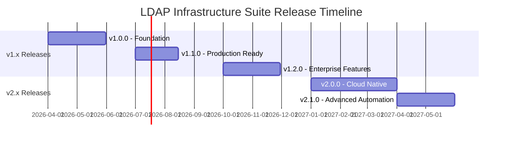

# LDAP Infrastructure Suite - Product Roadmap

This document outlines the planned features and enhancements for the LDAP Infrastructure Suite.

**Current Version**: 1.0.0-dev (Planning Phase)  
**Last Updated**: 2025-11-04  
**Planning Horizon**: 18-24 months

---

## Overview

The LDAP Infrastructure Suite provides a turnkey, containerized solution for deploying complete LDAP-based infrastructure. The roadmap focuses on:

1. **Foundation** - Docker Compose deployment and core integration
2. **Production Readiness** - Kubernetes/OpenShift support and enterprise features
3. **Advanced Features** - Automation, monitoring, and cloud-native capabilities
4. **Innovation** - AI/ML, multi-cluster, and advanced orchestration

---

## Release Timeline

---

## v1.0.0 - Foundation (Q2 2026) 🏗️

**Target Release**: May 31, 2026  
**Focus**: Docker Compose deployment and core service integration

### Docker Compose Deployment ⭐ **HIGH PRIORITY**

**Status**: Not started (Issue #1)

- **Complete Stack Orchestration**:
  - Single `docker-compose.yml` for all services
  - Environment variable configuration (`.env`)
  - Service dependencies and startup ordering
  - Health checks for all containers
  - Volume mounts for data persistence
  - Network isolation and internal DNS
  - Resource limits and requests
  - Automatic restart policies

- **Components Included**:
  - 389 Directory Service (2 replicas, multi-master)
  - Kea DHCP (2 replicas, hot-standby)
  - BIND 9 DNS (2 replicas, primary/secondary)
  - PostgreSQL (database for IPAM and audit logs)
  - Redis (sessions and caching)
  - LDAP Web Manager (backend + frontend)

- **Deployment Experience**:
  - One-command deployment: `docker-compose up -d`
  - Automatic service discovery
  - Pre-configured integration
  - No manual configuration required

### Service Integration ⭐ **HIGH PRIORITY**

**Status**: Not started (Issue #2)

- **Automatic Service Discovery**:
  - Kea DHCP → 389 DS (LDAP backend)
  - BIND 9 DNS → 389 DS (DLZ LDAP)
  - Web Manager → All services (management)
  - Service accounts auto-created

- **LDAP Schema Configuration**:
  - DHCP schema for Kea
  - DNS schema (idnsZone) for BIND
  - POSIX schema for users/groups
  - Custom schemas for IPAM

- **Data Flow**:
  - DHCP subnets stored in LDAP
  - DNS zones stored in LDAP
  - User/group data in LDAP
  - IPAM data in PostgreSQL
  - Sessions in Redis

### Custom Container Images

**Status**: Not started (Issues #3, #4, #5)

#### 389 Directory Service (Issue #3)
- Base image: `quay.io/389ds/dirsrv:latest`
- Custom schemas pre-installed
- Multi-master replication configured
- Service accounts created automatically
- Initialization scripts for OUs
- TLS/SSL enabled by default
- Health check endpoint

#### Kea DHCP (Issue #4)
- Kea DHCPv4 server with LDAP backend
- Kea Control Agent for API access
- Hot-standby HA configuration
- LDAP connection to 389 DS
- Subnet and host reservation from LDAP
- Lease statistics API
- Health check endpoint

#### BIND 9 DNS (Issue #5)
- BIND 9 with DLZ LDAP module
- Primary/secondary configuration
- Zone data from LDAP
- Dynamic updates support
- Zone transfers (AXFR/IXFR)
- DNSSEC support (optional)
- Query logging

### Web Manager Integration

**Status**: Not started (Issue #6)

- Use existing images from ldap-web-manager project
- Backend: `quay.io/infrastructure-alexson/ldap-web-manager-backend:latest`
- Frontend: `quay.io/infrastructure-alexson/ldap-web-manager-frontend:latest`
- Connected to all services
- DHCP management via Kea API
- DNS management via LDAP
- Service health dashboard

### Monitoring & Health Checks

**Status**: Not started (Issue #7)

- Health checks for all services
- Prometheus metrics endpoints
- `/health` endpoints where applicable
- Docker healthcheck directives
- Kubernetes readiness/liveness probe definitions
- Dashboard in Web Manager
- Alert conditions defined

### Documentation

**Status**: Not started (Issue #8)

- Complete installation guide
- Configuration reference
- Operations manual
- Architecture documentation
- Troubleshooting guide
- Quick start guide
- Example configurations

### Operational Tools

**Status**: Not started (Issues #9, #10)

- Automated backup scripts for all data
- Restore scripts with validation
- Container registry publication (Docker Hub, ghcr.io, Quay.io)
- CI/CD pipeline with GitHub Actions
- Multi-architecture builds (amd64, arm64)
- Security scanning

### Acceptance Criteria

- [ ] docker-compose.yml deploys full stack
- [ ] All services start and connect automatically
- [ ] Web Manager accessible and functional
- [ ] DHCP serves addresses from LDAP config
- [ ] DNS resolves zones from LDAP
- [ ] Health checks pass for all services
- [ ] Backup/restore scripts work
- [ ] Documentation complete
- [ ] Container images published

---

## v1.1.0 - Production Ready (Q3 2026) 🚀

**Target Release**: August 15, 2026  
**Focus**: Kubernetes deployment and production features

### Kubernetes Support

- **Kubernetes Manifests**:
  - Namespace definition
  - StatefulSets for 389 DS, Kea DHCP, BIND 9
  - Deployments for Web Manager
  - Services (ClusterIP, LoadBalancer)
  - ConfigMaps for configuration
  - Secrets for credentials
  - PersistentVolumeClaims for data
  - Ingress for web access

- **Kustomize Support**:
  - Base manifests
  - Overlays for dev/staging/production
  - Environment-specific configurations
  - Resource variations

### Helm Chart

- **Chart Development**:
  - Complete Helm chart: `ldap-infrastructure-suite`
  - Values-driven configuration
  - Dependency management (PostgreSQL, Redis charts)
  - Templating for flexibility
  - Pre-install/post-upgrade hooks
  - Chart testing
  - Helm repository hosting

- **Configuration Options**:
  - Replica counts
  - Resource limits/requests
  - Storage classes and sizes
  - TLS/SSL configuration
  - Ingress options
  - LDAP domain configuration

### Production Features

- **High Availability Enhancements**:
  - PostgreSQL streaming replication
  - Redis Sentinel for HA
  - Multiple Web Manager replicas
  - Load balancing for all services
  - Automatic failover

- **Monitoring Integration**:
  - Prometheus ServiceMonitors
  - Grafana dashboards (pre-built)
  - Alert rules for critical services
  - Log aggregation (EFK/ELK stack)
  - Distributed tracing (Jaeger)

- **Automated Backups**:
  - CronJob for scheduled backups
  - Backup to object storage (S3, GCS, Azure Blob)
  - Backup verification
  - Point-in-time recovery
  - Disaster recovery procedures

### Security Hardening

- **Network Policies**:
  - Kubernetes NetworkPolicies
  - Service-to-service communication rules
  - Ingress/egress traffic control
  - Pod security policies

- **Secrets Management**:
  - External Secrets Operator integration
  - HashiCorp Vault integration
  - Sealed Secrets support
  - Certificate management (cert-manager)

- **RBAC**:
  - Kubernetes RBAC policies
  - ServiceAccounts for each component
  - Principle of least privilege
  - Audit logging

### Documentation Updates

- Kubernetes deployment guide
- Helm chart documentation
- Production deployment checklist
- Performance tuning guide
- Security hardening guide
- Backup/restore procedures
- Disaster recovery playbook

---

## v1.2.0 - Enterprise Features (Q4 2026) 🏢

**Target Release**: November 30, 2026  
**Focus**: OpenShift support and enterprise capabilities

### OpenShift Support

- **OpenShift Template**:
  - Complete template for one-click deployment
  - Parameter-driven configuration
  - Routes for web access
  - ImageStreams with automatic rebuilds
  - DeploymentConfigs
  - SecurityContextConstraints
  - S2I (Source-to-Image) support

- **OpenShift Integration**:
  - OpenShift Service Catalog integration
  - OperatorHub listing
  - OpenShift Pipelines (Tekton)
  - OpenShift monitoring integration
  - OpenShift logging integration

### GitOps Integration

- **ArgoCD Support**:
  - ArgoCD Application manifests
  - ApplicationSet for multi-cluster
  - Sync waves for ordered deployment
  - Health checks
  - Automated rollbacks

- **Flux Support**:
  - Flux Kustomization
  - HelmRelease definitions
  - Git repository structure
  - Automated updates

### Advanced HA

- **Multi-Site Deployment**:
  - Active-passive across sites
  - LDAP replication across sites
  - DNS failover
  - Disaster recovery automation

- **Zero-Downtime Updates**:
  - Rolling updates for all services
  - Blue-green deployments
  - Canary deployments
  - Automated rollback on failure

### Compliance & Governance

- **Audit Enhancements**:
  - Comprehensive audit trail
  - Compliance reporting (SOC2, HIPAA, PCI-DSS)
  - Immutable audit logs
  - Audit log retention policies
  - Export for compliance reviews

- **Policy Enforcement**:
  - Open Policy Agent (OPA) integration
  - Custom policy definitions
  - Policy violations alerts
  - Automated remediation

### Performance Optimization

- **Database Optimization**:
  - PostgreSQL connection pooling (PgBouncer)
  - Read replicas for PostgreSQL
  - Query optimization
  - Materialized views for statistics

- **Caching Enhancements**:
  - Redis Cluster for horizontal scaling
  - Cache warming strategies
  - Intelligent cache invalidation
  - Cache hit rate monitoring

- **LDAP Optimization**:
  - Database tuning for 389 DS
  - Index optimization
  - Query performance monitoring
  - Connection pool tuning

---

## v2.0.0 - Cloud Native (Q1 2027) ☁️

**Target Release**: March 31, 2027  
**Focus**: Kubernetes Operator and cloud-native features

### Kubernetes Operator

- **Operator Development**:
  - Custom Resource Definitions (CRDs)
  - Operator SDK or Kubebuilder
  - Controller logic for reconciliation
  - Automated lifecycle management
  - Self-healing capabilities
  - Automated upgrades
  - Backup/restore automation

- **Custom Resources**:
  - `LDAPInfrastructure` - Main suite CR
  - `LDAPServer` - 389 DS instance
  - `DHCPServer` - Kea DHCP instance
  - `DNSServer` - BIND 9 instance
  - `LDAPBackup` - Backup CR
  - `LDAPRestore` - Restore CR

### Service Mesh Integration

- **Istio Support**:
  - Sidecar injection
  - Traffic management policies
  - mTLS between services
  - Observability integration
  - Circuit breaking
  - Retry policies

- **Linkerd Support**:
  - Lightweight service mesh
  - Automatic mTLS
  - Traffic splitting
  - Golden metrics

### Cloud Provider Integration

- **AWS Integration**:
  - EKS deployment automation
  - RDS for PostgreSQL (optional)
  - ElastiCache for Redis (optional)
  - Route53 DNS integration
  - S3 for backups
  - IAM roles for service accounts

- **Azure Integration**:
  - AKS deployment automation
  - Azure Database for PostgreSQL
  - Azure Cache for Redis
  - Azure DNS integration
  - Azure Blob Storage for backups
  - Managed identities

- **GCP Integration**:
  - GKE deployment automation
  - Cloud SQL for PostgreSQL
  - Cloud Memorystore for Redis
  - Cloud DNS integration
  - Cloud Storage for backups
  - Workload Identity

### Multi-Cluster Support

- **Cluster Federation**:
  - Deploy across multiple Kubernetes clusters
  - Global LDAP replication
  - Multi-cluster service discovery
  - Cross-cluster DNS
  - Unified management interface

- **Geographic Distribution**:
  - Regional deployments
  - Latency-based routing
  - Data residency compliance
  - Disaster recovery across regions

### Advanced Monitoring

- **Observability Platform**:
  - Prometheus for metrics
  - Grafana for visualization
  - Loki for logs
  - Tempo for traces
  - Unified observability stack

- **AI-Powered Monitoring**:
  - Anomaly detection
  - Predictive alerts
  - Capacity planning
  - Performance recommendations

---

## v2.1.0 - Advanced Automation (Q2 2027) 🤖

**Target Release**: June 30, 2027  
**Focus**: Automation and intelligent operations

### Automated Operations

- **Self-Healing**:
  - Automatic issue detection
  - Automated remediation
  - Service recovery procedures
  - Alert correlation
  - Root cause analysis

- **Auto-Scaling**:
  - HPA for Web Manager
  - VPA for resource optimization
  - Cluster autoscaling
  - Predictive scaling based on patterns

### Workflow Engine

- **User Provisioning Workflows**:
  - Automated account creation
  - Home directory creation
  - Email notifications
  - Group membership automation
  - Approval workflows

- **DNS Change Workflows**:
  - Approval for zone changes
  - Automated testing after changes
  - Rollback on failure
  - Change tracking

- **DHCP Workflows**:
  - Automatic DNS updates for reservations
  - IPAM integration
  - Conflict detection
  - Approval for static assignments

### Configuration Management

- **Terraform Provider**:
  - Terraform resources for all components
  - Infrastructure as code
  - State management
  - Drift detection

- **Ansible Collection**:
  - Ansible modules for management
  - Playbooks for common tasks
  - Inventory plugins
  - Role-based deployment

### AI/ML Features

- **Intelligent IPAM**:
  - Predictive IP allocation
  - Usage pattern analysis
  - Capacity forecasting
  - Optimization recommendations

- **Smart DNS**:
  - Traffic pattern analysis
  - Automatic cache optimization
  - Query pattern recognition
  - Anomaly detection

- **Intelligent Monitoring**:
  - Machine learning for baselines
  - Predictive failure detection
  - Automated incident response
  - Performance optimization suggestions

---

## v2.2.0+ - Future Innovations (2027+) 🚀

**Target Release**: TBD  
**Focus**: Cutting-edge features and innovations

### Advanced Networking

- **BGP Integration**:
  - Manage BGP announcements for IP blocks
  - Route optimization
  - Traffic engineering
  - Anycast DNS

- **SD-WAN Integration**:
  - Software-defined networking
  - Dynamic path selection
  - Multi-link aggregation
  - Policy-based routing

- **Network Topology Mapping**:
  - Automatic network discovery
  - Visual topology diagrams
  - Dependency mapping
  - Impact analysis

### Edge Computing

- **Edge Deployment**:
  - Lightweight deployment for edge locations
  - Intermittent connectivity support
  - Local caching and synchronization
  - Edge-to-cloud replication

- **IoT Integration**:
  - IoT device management in LDAP
  - Automated provisioning for IoT
  - Certificate management for devices
  - IoT-specific DHCP options

### Advanced Security

- **Zero Trust Architecture**:
  - Identity-based access control
  - Micro-segmentation
  - Continuous verification
  - Just-in-time access

- **Threat Detection**:
  - Security information and event management (SIEM)
  - Intrusion detection
  - Behavioral analysis
  - Automated response

### API & Integration Enhancements

- **GraphQL API**:
  - Alternative query interface
  - Flexible data fetching
  - Subscription support
  - Schema introspection

- **Webhooks**:
  - Event-driven notifications
  - Custom webhook endpoints
  - Retry logic
  - Payload templating

### Mobile Application

- **Native Mobile Apps**:
  - iOS and Android applications
  - Mobile dashboard
  - Push notifications
  - Offline capability
  - QR code scanning for device lookup

---

## Infrastructure Improvements

### Continuous Improvements Across All Releases

#### Performance
- Database query optimization
- Caching strategies
- Network optimization
- Resource efficiency

#### Security
- Regular security audits
- Dependency updates
- Vulnerability scanning
- Penetration testing
- Security advisory response

#### Testing
- Unit tests (80%+ coverage)
- Integration tests
- E2E tests with realistic scenarios
- Load testing and benchmarks
- Chaos engineering

#### DevOps
- CI/CD pipeline improvements
- Automated testing
- Deployment automation
- Infrastructure as code
- GitOps workflows

---

## Community & Ecosystem

### Community Building

- Public demo instance
- Community forum/discussions
- Monthly blog posts
- Conference presentations
- User group meetings

### Ecosystem Development

- Plugin marketplace
- Template library
- Integration examples
- Video tutorials
- Certification program

### Open Source

- Clear contributing guidelines
- Code of conduct
- Transparent governance
- Community calls
- Sponsorship program

---

## Feature Prioritization

Features are prioritized based on:

1. **User Impact**: How many users benefit?
2. **Completeness**: Does it complete existing features?
3. **Technical Debt**: Does it improve maintainability?
4. **Security**: Does it improve security posture?
5. **Community Requests**: Number of upvotes/requests

### How to Request Features

1. Open a GitHub Issue with "enhancement" label
2. Describe the use case and expected benefit
3. Provide examples or mockups if applicable
4. Upvote existing feature requests you support

**Feature Request Template**: https://github.com/infrastructure-alexson/ldap-infrastructure-suite/issues/new?template=feature_request.md

---

## Success Metrics

We measure success by:

- **Adoption**: Number of active deployments
- **Performance**: Deployment time, resource efficiency
- **Reliability**: Uptime, error rates, incident frequency
- **Community**: GitHub stars, contributors, issue resolution time
- **User Satisfaction**: NPS scores, survey feedback
- **Enterprise Adoption**: Production deployments, enterprise users

---

## Version Compatibility

### API Stability Promise

- **Major versions (v1.x → v2.x)**: May include breaking changes with migration guide
- **Minor versions (v1.1 → v1.2)**: Backwards compatible, deprecation warnings
- **Patch versions (v1.0.0 → v1.0.1)**: Bug fixes only, fully compatible

### Support Policy

- **Current major version**: Full support (features, bugs, security)
- **Previous major version**: Security updates for 12 months
- **Older versions**: Community support only

---

## Feedback & Updates

This roadmap is a living document and will be updated quarterly based on:

- User feedback and feature requests
- Technical constraints and opportunities
- Market trends and competition
- Available development resources

**Last Review**: 2025-11-04  
**Next Review**: 2026-02-01

---

## Get Involved

We welcome community input on the roadmap!

- **Vote on Features**: Comment on GitHub issues
- **Contribute Code**: Submit PRs for roadmap features
- **Share Ideas**: Open discussions on GitHub
- **Test Releases**: Try pre-release versions and provide feedback
- **Spread the Word**: Star the repo, write blog posts, give talks

---

**Questions about the roadmap?**  
Open a discussion: https://github.com/infrastructure-alexson/ldap-infrastructure-suite/discussions

**LDAP Infrastructure Suite Roadmap**  
**Version**: 1.0.0-dev  
**Last Updated**: 2025-11-04  
**Repository**: https://github.com/infrastructure-alexson/ldap-infrastructure-suite

